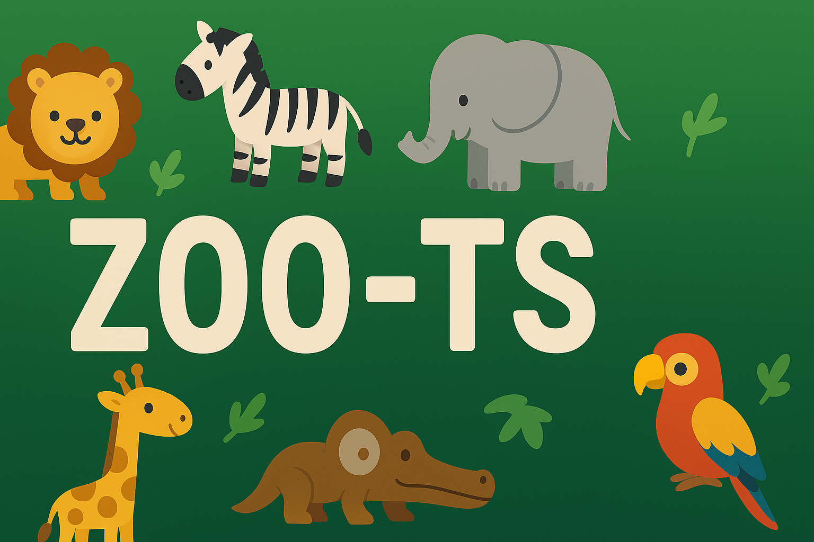

# 🐾 zoo-ts 🐘🦓🦒

Welcome to zoo-ts, a TypeScript-based simulation of a vibrant digital zoo! This project models various animals, behaviors, and zoo operations using clean, scalable code.

In this project, all the Typescript OOPS concepts are implemented.



---

## 📛 Badges


---

## 📦 Features

- 🐅 Animal Generator ⚙️
- 🌴 Habitat Manager 🧱
- 🍽 Feeding Scheduler ⏰
- 🎛 Interactive CLI Interface
- 🧠 Written with modern TypeScript

---

## 🚀 Getting Started

Install dependencies:

```bash
npm install
```

🛠️ Usage

```bash
npm run start
```

Open your browser and navigate to http://localhost:3000 to explore the zoo!

## 📁 Project Structure

```
zoo-ts/
│
├── src/
│ ├── animals/              # 🦁 Individual animal classes and traits
│ ├── behaviors/            # 🧠 Behavior patterns and interfaces
│ ├── zoo/                  # 🏛️ Zoo management logic
│ ├── utils/                # 🔧 Utility functions
│ └── index.ts              # 🚪 Entry point
│
├── tests/                  # ✅ Test files for unit & integration testing
├── README.md               # 📘 Project overview
├── package.json            # 📦 Dependencies and scripts
└── tsconfig.json           # 🛠️ TypeScript configuration
```

## 🧰 Technologies Used

| Technology     | Description                                    |
| -------------- | ---------------------------------------------- |
| TypeScript 🧪  | Strongly typed language for scalable JS        |
| Node.js 🔧     | Runtime environment for executing JS           |
| Jest 🧫        | Testing framework for unit & integration tests |
| ES6 Modules 📦 | Modular code structure using `import`/`export` |

## 🎯 Features

| Feature                       | Description                                      |
| ----------------------------- | ------------------------------------------------ |
| 🐾 Dynamic Species Management | Add and manage animal species on the fly         |
| 🤝 Behavior Simulation        | Simulate interactions and traits between animals |
| 🧩 Interface-Based Design     | Use polymorphism for flexible architecture       |
| ✅ Unit-Tested Reliability    | Thoroughly tested for consistent performance     |

## ⚙️ Scripts & Commands

| Command         | Purpose                     |
| --------------- | --------------------------- |
| `npm start`     | Run the main zoo simulation |
| `npm test`      | Execute test suite          |
| `npm run build` | Transpile TypeScript        |

## 📸 Screenshots

(Optional: Add images or GIFs of console output or visualizations if any)

## 🌐 Live Demo

Check out the live version hosted on GitHub Pages: [🔗 Zoo-TS Demo](https://milanmmore.github.io/zoo-ts)

## 🙌 Contributors

Made with ❤️ by Milan More and open to collaboration!

## refer

```
https://github.com/Yasin-asif/SQA-Professional-Portfolio.git
https://github.com/sanajrd/qa-automation-portfolio
https://github.com/nicokei9/qa-automation-portfolio
https://github.com/AndreeaLF/QA-Automation-Portfolio---Cypress-Tests
https://github.com/julietajbenitez/playwright-ts-automation-portfolio
https://github.com/script-hermit/qa-automation-portfolio
```
